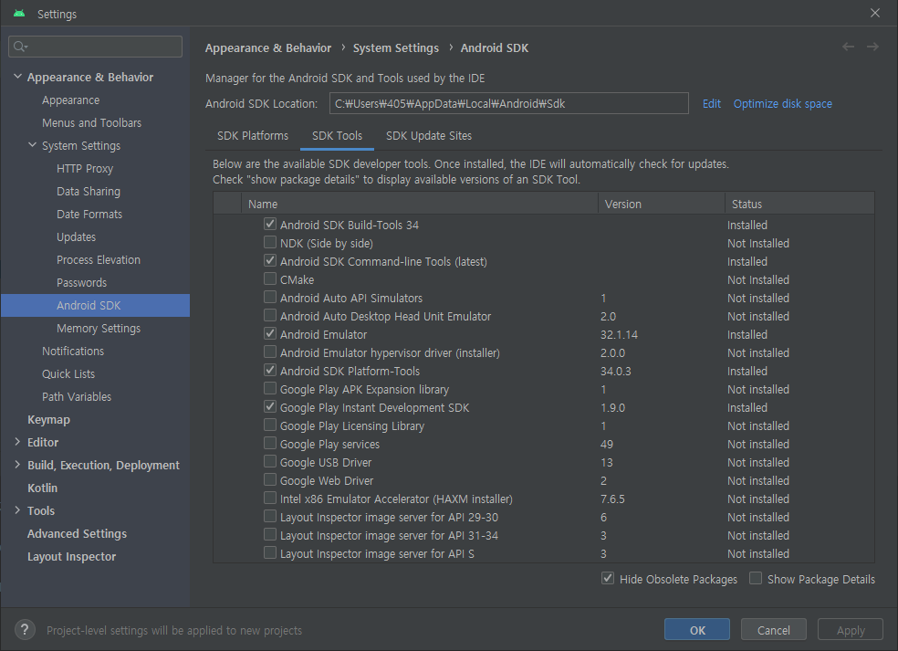

# AndroidStudioProjects

## 각 md파일로 이어지도록 목차 같은거 만들기
## 코드.md파일 simpleMemo부터 정리하기

## 프로젝트 생성
- new project
- no activity
- 이름/패키지 및 자바 설정과 생성
- 자바폴더 우클릭 - new - activity - empty views activity

## 메모
### 주로 사용하는 파일 및 폴더
#### 파일
- AndroidManifest.xml  
앱 이름, 아이콘 등 외부요소 관련
- MainActivity.java  
로직 관련
- build.gradle(:app)  
오픈소스 라이브러리 사용 관련
- activity_main.xml  
화면 관련
#### res폴더(resources)
- layout: 화면의 레이아웃과 관련된 폴더
- drawable: 이미지 폴더
- raw: 음향 폴더
- values/string.xml: 문자 관리 파일.
추후 번역이 필요할 때 이 파일 내의 문자만 번역하면 된다.

## 개발순서
- 화면(XML)개발 -> 로직(JAVA)개발

## 자잘한 메모
- SDK는 소프트웨어 디벨로퍼 키트의 약자
- 안드로이드 개발에는 보통 이미지파일을 png로 사용
- dp는 뷰화면 구성할 때 픽셀단위
- sp는 글자의 크기를 나타낼 때 쓰는 단위
- 레이아웃에 쓰이는 것들의 id를 자바의 멤버변수명과 맞추면 유지보수가 쉬움  
(변수의 타입은 각 레이아웃의 이름)

## 개발환경

