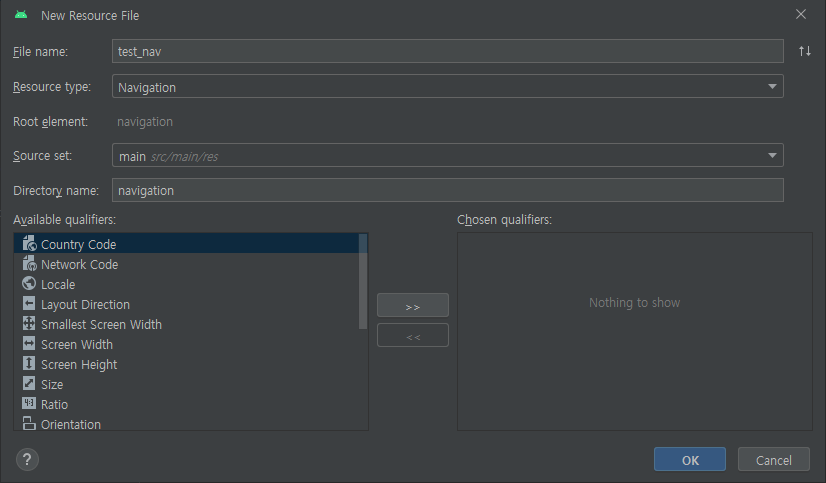
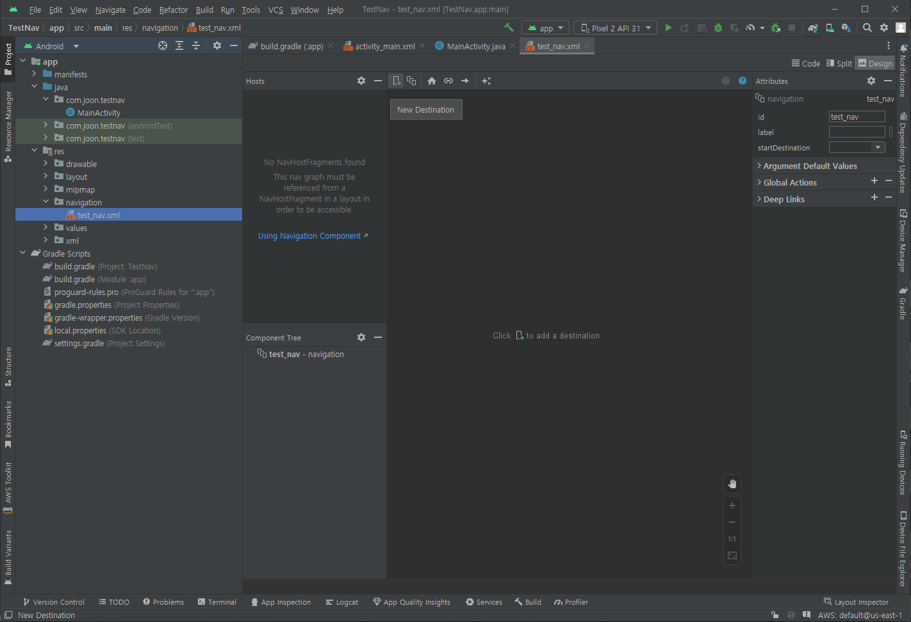
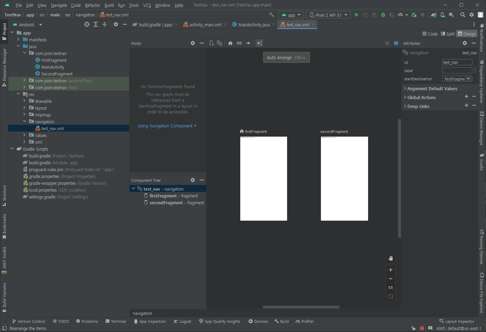
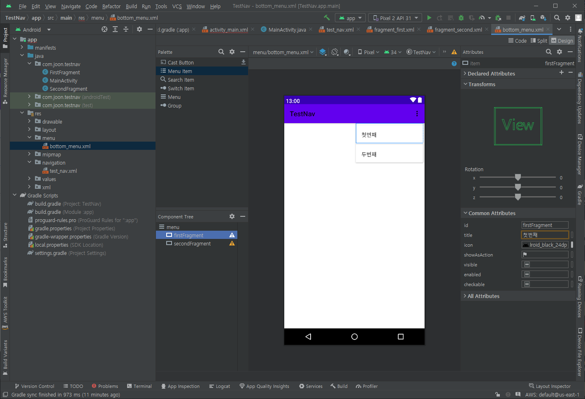
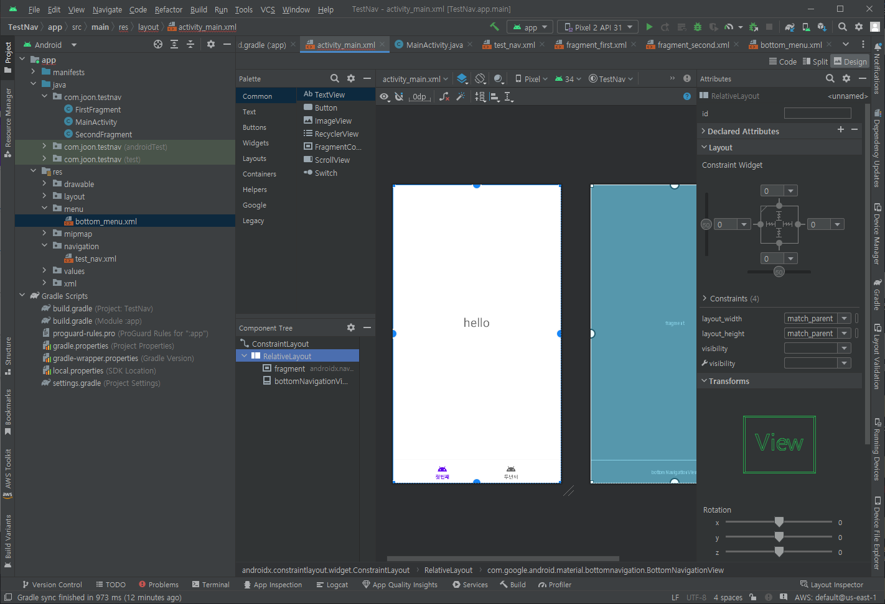
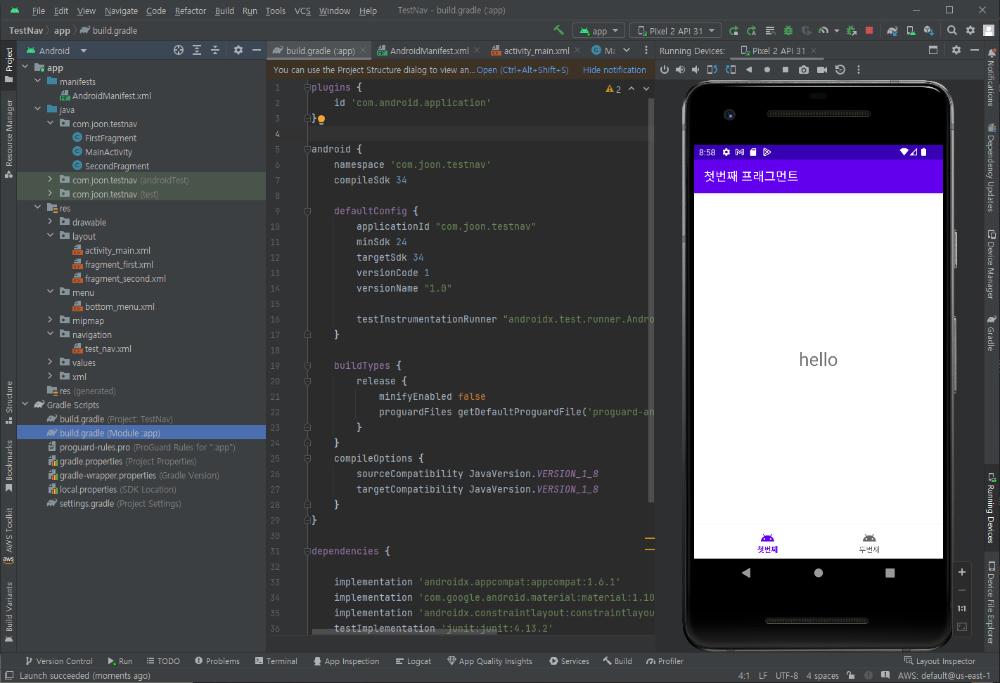

# NavigationVar
- BottomTapBar 라고도 불림.

## gradle(앱수준)
```gradle
dependencies {
    implementation 'androidx.navigation:navigation-fragment:2.5.3'
    implementation 'androidx.navigation:navigation-ui:2.5.3'
}
```

## res
### navigation
- res폴더 우클릭 -> New -> Android Resource File 선택
- 아래와 같이 생성


- \+ 버튼(New Destination)을 선택하여 Fragment 추가



### menu
- res폴더 우클릭 -> New -> Android Resource File 선택
- 아래와 같이 생성


- 메뉴 설정하기(id, 내용, 이미지 등)


## 액티비티
- 다음과 같이 생성하기


```xml
<?xml version="1.0" encoding="utf-8"?>
<androidx.constraintlayout.widget.ConstraintLayout xmlns:android="http://schemas.android.com/apk/res/android"
    xmlns:app="http://schemas.android.com/apk/res-auto"
    xmlns:tools="http://schemas.android.com/tools"
    android:layout_width="match_parent"
    android:layout_height="match_parent"
    tools:context=".MainActivity">

    <RelativeLayout
        android:layout_width="match_parent"
        android:layout_height="match_parent"
        app:layout_constraintBottom_toBottomOf="parent"
        app:layout_constraintEnd_toEndOf="parent"
        app:layout_constraintStart_toStartOf="parent"
        app:layout_constraintTop_toTopOf="parent">

        <androidx.fragment.app.FragmentContainerView
            android:id="@+id/fragment"
            android:name="androidx.navigation.fragment.NavHostFragment"
            android:layout_width="match_parent"
            android:layout_height="match_parent"
            android:layout_above="@id/bottomNavigationView"
            app:defaultNavHost="true"
            app:navGraph="@navigation/test_nav" />

        <com.google.android.material.bottomnavigation.BottomNavigationView
            android:id="@+id/bottomNavigationView"
            android:layout_width="match_parent"
            android:layout_height="wrap_content"
            android:layout_alignParentBottom="true"
            app:labelVisibilityMode="labeled"
            app:menu="@menu/bottom_menu">
        </com.google.android.material.bottomnavigation.BottomNavigationView>
    </RelativeLayout>
</androidx.constraintlayout.widget.ConstraintLayout>
```

## 결과


## 프래그먼트 내의 코드이용 예시
- FirstFragment.java 파일

### 인스턴스 변수
```java
public class FirstFragment extends Fragment {

    // 코드 생략

    // todo: 이곳에 작성
    Button btnAdd;
    ProgressBar progressBar;
    RecyclerView recyclerView;
    PostingAdapter adapter;

    // 코드 생략
}
```

### 지역 변수
- 액티비티 호출을 위해서는 getActivity() 함수 이용하기
```java
@Override
public View onCreateView(LayoutInflater inflater, ViewGroup container,
                         Bundle savedInstanceState) {
    // Inflate the layout for this fragment
    ViewGroup rootView = (ViewGroup) inflater.inflate(R.layout.fragment_first, container, false);


    // todo: 이곳에 작성
    btnAdd = rootView.findViewById(R.id.btnAdd);
    progressBar = rootView.findViewById(R.id.progressBar);


    btnAdd = rootView.findViewById(R.id.btnAdd);
    progressBar = rootView.findViewById(R.id.progressBar);

    recyclerView = rootView.findViewById(R.id.recyclerView);
    recyclerView.setHasFixedSize(true);
    recyclerView.setLayoutManager(new LinearLayoutManager(getActivity()));


    return rootView;
}
```

## 디버깅
### 에러메세지1
```
Also, the maximum recommended compile SDK version for Android Gradle
plugin 8.0.2 is 33.

Recommended action: Update this project's version of the Android Gradle
plugin to one that supports 34, then update this project to use
compileSdk of at least 34.

Note that updating a library or application's compileSdk (which
allows newer APIs to be used) can be done separately from updating
targetSdk (which opts the app in to new runtime behavior) and
minSdk (which determines which devices the app can be installed
on).
```
#### 원인
- 에러 메시지는 귀하의 프로젝트가 현재 Android 33에 대해 컴파일되어 있지만, 종속성 'androidx.activity:activity-ktx:1.8.0'은 Android 34 이상을 필요로 한다는 것을 나타냅니다. 또한 Android Gradle 플러그인 8.0.2의 최대 권장 컴파일 SDK 버전은 33입니다.

#### 해결
- gradle(앱수준) 파일 수정
```gradle
android {
    compileSdkVersion = 34
    targetSdkVersion = 34
}
```